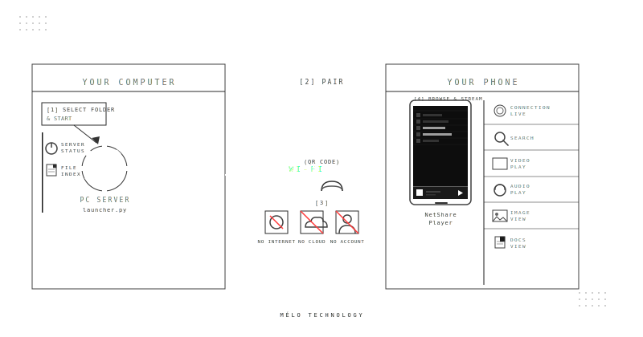

  

# NETSHARE PLAYER
### Your files. Your network. Your terms.

**Stream any file from your computer to your phone instantly.** No cloud. No accounts. No limits. Just seamless local streaming.

---

##  The Concept
**NetShare Player** turns your computer into a private media hub. It bypasses the "cloud" entirely, keeping your data on your own Wi-Fi. It's built for those who value privacy, speed, and a clean, minimalist aesthetic.

* **Private by Design:** Your data never leaves your home network.
* **Zero Configuration:** Auto-discovery finds your PC so you don't have to mess with IP addresses.
* **Lightweight:** A monochrome, minimalist design that stays out of your way.

---

##  How It Works

  

1. **Select & Start:** Run the application netshare server and pick any folder.
2. **Pair:** Scan the unique QR code with the mobile app.
3. **Stream:** Your files appear instantly on your phone over Wi-Fi.

---

##  The Experience

###  Desktop Launcher
A sleek, geometric Python application that serves as your gateway.
* **One-Scan Connection:** QR code generation for instant mobile pairing.
* **Smart Indexing:** High-speed file walking with Gzip caching—restarts in seconds.
* **Live Watchdog:** Automatically detects when you add or delete files.

###  Mobile App
A fluid, high-performance Flutter application designed for seamless consumption.
* **Cinematic Video:** Hardware-accelerated playback with gesture controls.
* **Hi-Fi Audio:** Background playback with lock-screen controls.
* **Global Reach:** Fully translated into 10 languages.

---

##  Limitless Media
NetShare handles almost anything you throw at it:

| Category | Highlights |
| :--- | :--- |
| **Video** | MP4, MKV, AVI, MOV |
| **Audio** | MP3, FLAC, AAC, WAV |
| **Images** | JPG, PNG, WEBP, GIF |
| **Docs** | PDF, TXT, Markdown |

---

### Join the local revolution.
*Stop uploading. Start sharing.*

 

**Made with  by Mélo Technology**

